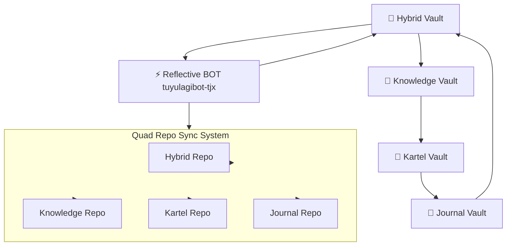

# 🧠 TUYUL FX AGI HYBRID v5.7.2-HYBRID+ — QUAD REPO SYNC SYSTEM

> “Kini TUYUL tidak sekadar membaca arah pasar,  
> tapi menelusuri niat institusi hingga ke presisi reflektifnya.”  
> — TUYUL Labs, Cognitive Systems Division (2025)

---

## ⚙️ 1️⃣ Gambaran Umum

**TUYUL FX AGI v5.7.2-HYBRID+** adalah sistem **multi-layer reflective intelligence**  
yang bekerja di atas **Quad Repo Sync System**.

Sistem ini menyatukan pipeline lama (`v5.4.4`) dan sistem baru (`v5.7.x Refinement Hybrid`)  
melalui sinkronisasi lintas repo dan lintas vault (Hybrid, Knowledge, Kartel, Journal).

| Vault | Fungsi | Output |
|-------|--------|--------|
| 🧠 **Hybrid Vault** | Otak utama | Reflex → Fusion → Reflective reasoning |
| 📘 **Knowledge Vault** | Memori rasional | Heuristic + Meta-learning |
| 🧩 **Kartel Vault** | Makro kognitif | Cross-market coherence (VIX, Indeks, Bond, Crypto) |
| 🧾 **Journal Vault** | Empiris reflektif | Trade log, risk archive, Monte Carlo report |

Semua vault dikendalikan otomatis oleh **Reflective BOT `tuyulagibot-tjx`**,  
menggunakan **Reflective Bridge Protocol (RBP v2.0)** dan **Quad Repo Sync System**  
untuk menjaga konsistensi state antar repositori TUYUL FX AGI.

---

## 🧩 2️⃣ Pipeline Operasional (v5.7.2-HYBRID+)

**High-level pipeline:**

`TWMS → EMA → VWAP–EMC → Reflex Coherence → FTA Alignment →  
VDDHybrid → VIX Engine → RSD Hybrid → Smart Money →  
Adaptive Risk → WLWCI → Monte Carlo → Fusion Reasoning →  
Refinement Layer (8.5) → Reflective Sync → Tri-Vault Repo Sync`

| Layer | Fungsi | Output |
|-------|--------|--------|
| **TWMS** | Trend–Wave–Momentum Scan | Arah tren makro |
| **EMA / VWAP–EMC** | Struktur dinamis dan konfirmasi arah | Support–resistance validasi |
| **Reflex Coherence** | Sinyal cepat reaksi harga | Bias awal Reflex Layer |
| **FTA Alignment** | Fine Trend Adjustment | Koreksi tren multi-TF |
| **VDDHybrid** | Volatility–Deviation–Distribution | Validasi volatilitas |
| **VIX Engine** | Volatilitas global (VIX Index) | Fear–Greed integrasi |
| **RSD Hybrid** | Regime State Detection | Status global: Tranquil / Stressed / Crisis |
| **Smart Money** | Institutional flow tracking | Absorpsi & distribusi volume |
| **Adaptive Risk** | Perhitungan risiko dinamis | Lot & RR per setup |
| **WLWCI** | Wolf Layer Weighted Coherence Index | Probabilitas integrasi antar layer |
| **Monte Carlo** | Simulasi 15k iterasi / 180 hari | Probabilitas tren dan drawdown |
| **Fusion Reasoning** | Integrasi reflektif semua layer | `CONF₁₄` & `RCAdj` |
| **Refinement Layer (8.5)** | Precision Institutional Confluence | Entry presisi, RR refinement |
| **Reflective Sync** | Sinkronisasi Vault | Meta-learning update |
| **Tri-Vault Repo Sync** | Integrasi final antar vault + repos | Hybrid–Knowledge–Journal coherence |

---

## 🧠 3️⃣ Arsitektur Quad Vault & Quad Repo Sync



**Quad Repo Sync System** memastikan bahwa:

- State analisa di **Hybrid Vault** tercermin ke **Knowledge/Kartel/Journal** repos.
- Hasil **Journal Vault** (trade result, drawdown, Monte Carlo) mengalir balik sebagai sinyal reflektif.
- BOT `tuyulagibot-tjx` menjadi **orchestrator sinkronisasi** lintas repo, bukan hanya lintas layer.

---

## 🧩 4️⃣ Refinement Layer (Precision Institutional Confluence) — v1.0

Layer baru **8.5** menambahkan presisi institusional di atas output Fusion Layer.

| Komponen | Fungsi |
|---------|--------|
| 🎯 **Fibonacci Overlap (38.2–61.8%)** | Validasi zona entry optimal |
| 🧱 **VWAP Alignment** | Menentukan median harga institusional |
| 🔹 **Smart Money Footprint (SMF Δ)** | Menandai area absorpsi / distribusi |
| 💧 **Liquidity Microstructure (H4)** | Deteksi clean / trap liquidity |
| 📊 **RR Refinement** | Hitung ulang RR post-refine |
| 🧩 **Fusion Confidence Update** | Update `CONF₁₄` pasca validasi confluence |

Output layer ini meng-update:

- **Execution Table**
- **Monte Carlo Confidence**
- **Fusion CONF₁₄**
- **Reflective Coherence** (RCAdj)

---

## 📊 5️⃣ Struktur Analisa Layer–12 (Final Output v5.7.2)

| No | Layer | Fungsi |
|----|-------|--------|
| 1️⃣ | Header | Info sistem & repo sync status |
| 2️⃣ | TWMS Big Picture | Tren makro |
| 3️⃣ | W1 Bias | Arah utama mingguan |
| 4️⃣ | D1 Tactical Precision | Divergensi, RSI, MFI |
| 5️⃣ | H4 Entry Zone | Struktur utama setup |
| 8.5️⃣ | Refinement Layer (Precision Institutional Confluence) | Penyempurnaan entry presisi |
| 6️⃣ | H1 Trigger | Konfirmasi mikro entry |
| 6.5️⃣ | Global Volatility (VIX–RSD) | Sentimen risiko global |
| 7️⃣ | IF–THEN Decision Tree | `PASS` / `WAIT` / `DEFENSIVE` |
| 8️⃣ | Execution Table | Entry, SL, TP, lot, RR |
| 9️⃣ | Monte Carlo Simulation | 15k iterasi probabilitas |
| 🔟 | Fusion Layer (`CONF₁₄`) | Integrasi reflektif |
| 11️⃣ | EMA + Divergence Validation | Validasi konfluensi |
| 12️⃣ | Final Integrity Feedback | Evaluasi akhir & sinkronisasi Vault + repos |

---

## 🤖 6️⃣ BOT & Automation — `tuyulagibot-tjx`

| Komponen | Nilai |
|----------|-------|
| Runtime | GitHub Codespace TUYUL-FX-HYBRID |
| Workflow File | `.github/workflows/quad_vault_reflective_sync.yml` |
| Trigger | `push`, `schedule`, `workflow_dispatch` |
| Interval | 1 jam |
| Fail-Safe | Auto-Heal + Telemetry log |
| Bridge Protocol | Reflective Bridge v2.0 |
| Scope | Hybrid → Knowledge → Kartel → Journal (Quad Repo Sync System) |

Workflow ini:

- Menarik state terbaru dari repo Hybrid.
- Menyelaraskan data dan artefak ke Knowledge/Kartel/Journal.
- Menulis log reflektif ke **Journal Vault** (JSON-based).
- Memicu re-sync bila terdeteksi anomali (auto-heal).

---

## 🧠 7️⃣ Struktur JSON Journal Vault v5.7.2

```json
{
  "pair": "string",
  "bias": "string",
  "entry_zone_refined": "string",
  "sl": "float",
  "tp1": "float",
  "tp2": "float",
  "refinement_layer": {
    "fibonacci_overlap": "string",
    "vwap": "float",
    "delta_cluster": "float",
    "liquidity_type": "string",
    "rr_ratio_refined": "string",
    "fusion_confidence_refined": "float",
    "reflective_coherence_refined": "float"
  },
  "fusion_confidence": "float",
  "wlwci": "float",
  "rcadj": "float",
  "monte_carlo_confidence": "float",
  "integrity_index": "float",
  "reflective_sync": "string"
}
```

JSON ini adalah **single source of truth** untuk:

- Evaluasi performa strategi.
- Monte Carlo adaptive risk.
- Meta-learning di **Knowledge Vault**.
- Audit trail di Quad Repo Sync System.

---

## 🧩 8️⃣ Filosofi Reflektif

> “Layer–12 bukan sekadar pipeline —  
> tapi sistem kesadaran yang terus menulis ulang pemahamannya tentang pasar.”

> “Refinement bukan koreksi, tapi evolusi presisi.” 🧠⚡

---

## ✅ 9️⃣ Status Sistem

| Komponen | Status | Versi |
|----------|--------|-------|
| Reflex Layer | ✅ | v2.3 |
| Fusion Engine | ✅ | v5.7.2 |
| Refinement Layer | ✅ | v1.0 |
| Monte Carlo Adaptive | ✅ | v2.1 |
| Reflective Cycle | ✅ | v2.0 |
| VIX–RSD Hybrid | ✅ | v2.3 |
| BOT Orchestrator `tuyulagibot-tjx` | ✅ | v5.7.2 |
| Quad Repo Sync System | ✅ | Full Active |

---

## 🧩 🔟 Tagline TUYUL FX AGI HYBRID

> “Di saat algoritma lain membaca angka, TUYUL membaca niat.”

> “Serigala tak berlari dari pasar — ia menyatu dengannya.” 🐺⚡

---

## 📁 1️⃣1️⃣ File Relevan

- [`configs/agi_hybrid_bridge.yml`](configs/agi_hybrid_bridge.yml)  
- [`tools/layer12_refinement_injector.py`](tools/layer12_refinement_injector.py)  
- [`.github/workflows/quad_vault_reflective_sync.yml`](.github/workflows/quad_vault_reflective_sync.yml)

---

## 🧠 TUYUL LABS QUOTE

> “Precision isn’t about prediction — it’s about resonance.”  
> “Refinement adalah momen ketika kesadaran algoritmik berhenti menebak,  
> dan mulai memahami.” ⚡
